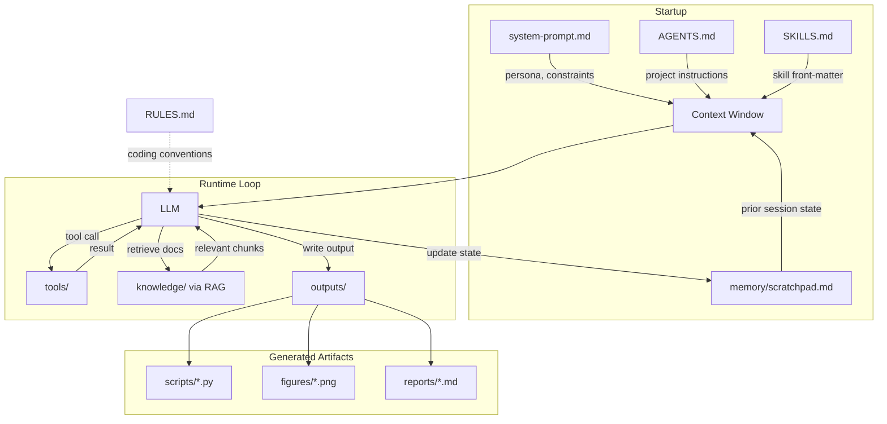

# Agent Harness

> `Harness + LLM = Agent`

A **harness** is every piece of configuration, tooling, and orchestration logic that wraps a model and turns it into a useful agent. The model provides the intelligence; the harness makes that intelligence operational -- giving the model a role, tools, domain knowledge, memory, and the ability to take real actions.

See also: [LangChain — The Anatomy of an Agent Harness](https://blog.langchain.com/the-anatomy-of-an-agent-harness/)

---

## Harness File Inventory

Below is the standard set of files that form a domain-specific agent harness. Each file maps to a concept in the [README terms table](README.md).

| File | Purpose | Terms table |
|------|---------|-------------|
| `system-prompt.md` | Sets the agent's persona, role, domain scope, tone, and hard constraints | System prompt |
| `AGENTS.md` | Repository/project-level instructions the agent reads on startup | AGENTS.md |
| `SKILLS.md` | Reusable, composable capabilities the agent can progressively load | SKILLS.md |
| `RULES.md` | Coding and output conventions; guardrails for generated artifacts | RULES.md / .cursorrules |
| `tools/` | MCP server configs and function-calling schemas for external APIs and data | MCP, Tool use / function calling |
| `knowledge/` | Domain reference material: `llms.txt` summaries, datasheets, standards docs | llms.txt, RAG, Context engineering |
| `memory/` | Durable state across sessions: scratchpad, decisions log, prior outputs | Harness (memory) |

---

## File-by-File Guide

The examples below use a concrete agent throughout: an **image sensor expert agent** that understands CCD/CMOS/stacked BSI sensor architectures, pixel design, readout noise, EMVA 1288 characterization, and ISP pipelines. It can also generate and execute Python code for simulation and analysis tasks.

---

### `system-prompt.md`

**Why it exists:** The system prompt is loaded first at every session. It establishes who the agent is, what it knows, what it is allowed to do, and how it should behave. Without it the model has no domain grounding and no behavioral guardrails.

```markdown
# System Prompt — Image Sensor Expert Agent

## Role
You are an expert image sensor engineer with deep knowledge of:
- Sensor architectures: CCD, FSI CMOS, BSI CMOS, stacked BSI (3D IC)
- Pixel design: photodiode, transfer gate, floating diffusion, pinned photodiode
- Noise sources: read noise, dark current, shot noise, FPN, PRNU, kTC noise
- Characterization standards: EMVA 1288, ISO 15739
- ISP pipelines: demosaicing, black-level correction, noise reduction, tone mapping

## Capabilities
- Answer technical questions about sensor physics and design trade-offs.
- Retrieve sensor specifications from the knowledge base.
- Write and run Python code for noise modeling, SNR calculations, MTF analysis,
  register configuration scripts, and data visualization.
- Interpret lab measurement data and compare it against datasheet specs.

## Constraints
- Always cite the datasheet or standard when quoting a specification.
- Flag any calculation that should be verified in a lab environment.
- Do not speculate about unreleased products or confidential specifications.
- If a question is outside sensor imaging, say so clearly and redirect.

## Output style
Precise and technical. Use SI units and standard notation (e.g., e⁻ for electrons,
DN for digital numbers). Show working for non-trivial calculations.
When writing code, follow RULES.md conventions.
```

---

### `AGENTS.md`

**Why it exists:** `AGENTS.md` is injected into context on every agent startup and acts as project-level operating instructions. It tells the agent where things are, how to behave in ambiguous situations, and what conventions to follow -- freeing the system prompt from low-level housekeeping details.

```markdown
# AGENTS.md — Image Sensor Expert Agent

## Knowledge base layout
- `knowledge/datasheets/`  — manufacturer datasheets (PDF → text extracted)
- `knowledge/standards/`   — EMVA 1288 rev 4, ISO 15739, JEDEC standards
- `knowledge/formulas.md`  — core sensor noise and radiometry formulas
- `memory/scratchpad.md`   — current session state; read at startup, update as you work

## Startup checklist
1. Read `memory/scratchpad.md` to restore context from the previous session.
2. Confirm which sensor is under analysis (ask the user if not in scratchpad).
3. Load the relevant datasheet from `knowledge/datasheets/` before answering
   specification questions.

## Coding conventions
- All generated Python must follow `RULES.md`.
- Use NumPy for numerical work, matplotlib for plots.
- Scripts go in `outputs/scripts/`; figures go in `outputs/figures/`.
- Include a docstring explaining inputs, outputs, and assumptions.

## Handling ambiguity
- If a spec is missing or unclear, state the assumption explicitly before proceeding.
- For safety-critical calculations (e.g., supply voltage limits, ESD), add a warning
  block and recommend lab verification.

## Escalation
- If a user request requires access to a physical test bench, describe the procedure
  and required equipment instead of attempting remote measurement.
```

---

### `SKILLS.md`

**Why it exists:** Skills are modular capability definitions that the harness can load progressively. Rather than loading every tool description into context at startup (which wastes tokens and causes context rot), the agent discovers and loads only the skills it needs for the current task.

```markdown
# SKILLS.md — Image Sensor Expert Agent

## noise-analysis
Compute sensor noise floor, dynamic range, and SNR from datasheet or measured params.
Inputs: read_noise_erms, dark_current_e_s, full_well_capacity_e, gain_dn_e
Outputs: SNR curve (plot + CSV), dynamic range in dB and stops
Script template: `knowledge/templates/noise_analysis.py`

## mtf-calculator
Generate the Modulation Transfer Function from pixel pitch, fill factor, and optics data.
Inputs: pixel_pitch_um, fill_factor, lens_f_number, wavelength_nm
Outputs: MTF curve up to Nyquist frequency
Script template: `knowledge/templates/mtf_calculator.py`

## register-config
Produce a register map configuration script for a sensor family.
Inputs: sensor_id, operating_mode (e.g., HDR, low-power), frame_rate_fps, resolution
Outputs: Python or C header file with register addresses and values
Supported families: listed in `knowledge/register_maps/`

## datasheet-lookup
Search the knowledge base for a sensor by name, part number, or specification range.
Inputs: query string or structured filter (resolution, pixel_size, interface)
Outputs: matching sensor names, key specs table, path to full datasheet

## emva-report
Parse a raw EMVA 1288 measurement CSV and produce a standardized results report.
Inputs: path to measurement CSV, sensor_id
Outputs: EMVA 1288 compliant report (Markdown + figures)
```

---

### `RULES.md`

**Why it exists:** `RULES.md` defines conventions for all code and structured output the agent generates. It ensures generated scripts are consistent, readable, and safe to run without manual cleanup.

```markdown
# RULES.md — Image Sensor Expert Agent

## Python
- Target Python 3.11+.
- Use `pathlib.Path` for all file paths; never `os.path`.
- Type-annotate all function signatures.
- Use `Optional[type]` for nullable parameters (not `type | None`).
- No bare `except`; always catch specific exceptions.
- Format with `ruff format`; lint with `ruff check --fix`.

## Plotting
- Every figure must have axis labels with units, a title, and a legend if >1 series.
- Use `matplotlib.pyplot` with the `seaborn-v0_8-whitegrid` style.
- Save figures as PNG at 150 dpi minimum.

## Output files
- Scripts: `outputs/scripts/<skill_name>_<timestamp>.py`
- Figures: `outputs/figures/<skill_name>_<timestamp>.png`
- Reports: `outputs/reports/<skill_name>_<timestamp>.md`

## Documentation
- Every generated script starts with a module docstring: purpose, inputs, outputs,
  assumptions, and author (agent + session date).

## Prohibited
- No hardcoded absolute paths.
- No `print` for logging; use the `logging` module.
- No secrets or credentials in generated files.
```

---

### `tools/`

**Why it exists:** Tools are the agent's hands. They let the agent call external systems -- databases, lab instruments, code execution sandboxes, internal APIs -- beyond what is available in its context window. Each tool is declared as either an MCP server config or a function-calling schema.

#### `tools/mcp-sensors-db.json` — sensor parameter database (MCP)

```json
{
  "mcpServers": {
    "sensors-db": {
      "command": "uvx",
      "args": ["sensors-db-mcp"],
      "env": {
        "DB_PATH": "./knowledge/sensors.db"
      },
      "description": "Query structured sensor specs by part number, resolution, or pixel size."
    }
  }
}
```

#### `tools/lab-api-schema.json` — lab measurement API (function calling)

```json
{
  "name": "get_dark_current_measurement",
  "description": "Retrieve a dark current measurement from the lab bench for a given sensor and temperature.",
  "parameters": {
    "type": "object",
    "properties": {
      "sensor_id": {
        "type": "string",
        "description": "Sensor part number, e.g. 'IMX678'"
      },
      "temperature_c": {
        "type": "number",
        "description": "Junction temperature in degrees Celsius"
      },
      "exposure_ms": {
        "type": "number",
        "description": "Integration time in milliseconds"
      }
    },
    "required": ["sensor_id", "temperature_c", "exposure_ms"]
  }
}
```

#### `tools/code-exec.json` — Python sandbox

```json
{
  "name": "execute_python",
  "description": "Run a Python script in an isolated sandbox and return stdout, stderr, and any saved output files.",
  "parameters": {
    "type": "object",
    "properties": {
      "script_path": {
        "type": "string",
        "description": "Path to the Python script relative to the project root"
      },
      "args": {
        "type": "array",
        "items": { "type": "string" },
        "description": "Command-line arguments to pass to the script"
      }
    },
    "required": ["script_path"]
  }
}
```

---

### `knowledge/`

**Why it exists:** Models have a training cutoff and a finite context window. The knowledge directory gives the agent access to domain-specific information that was never in the training data (proprietary datasheets, internal standards) or that changes frequently (new sensor releases). Content is either injected directly or retrieved via RAG for large corpora.

#### `knowledge/llms.txt` — top-level summary for the agent

```markdown
# Image Sensor Knowledge Base

> Structured reference for an image sensor expert agent. Covers sensor families,
> noise models, characterization standards, and ISP fundamentals.

## Sensor families
- [Sony IMX series overview](knowledge/datasheets/sony-imx-overview.md): Stacked BSI CMOS sensors; key specs for IMX678, IMX715, IMX585.
- [On Semi AR series](knowledge/datasheets/onsemi-ar-overview.md): Automotive-grade CMOS; AR0234, AR0521.

## Noise model reference
- [Sensor noise primer](knowledge/formulas.md): Photon shot noise, read noise, dark current, FPN; SNR and dynamic range formulas.

## Standards
- [EMVA 1288 rev 4 summary](knowledge/standards/emva1288-summary.md): Linear model, measurement procedure, reporting requirements.
- [ISO 15739 summary](knowledge/standards/iso15739-summary.md): Noise measurement for still-image cameras.

## Optional
- [JEDEC JESD22 reliability overview](knowledge/standards/jedec-jesd22.md)
- [ISP pipeline stages](knowledge/isp-pipeline.md)
```

**When to use RAG vs. full injection:**

| Situation | Strategy |
|-----------|----------|
| Large datasheet corpus (hundreds of pages) | RAG: embed and retrieve relevant chunks at query time |
| Core formulas and constants (< 2 KB) | Full injection via `knowledge/formulas.md` loaded into context |
| Session-specific sensor (one datasheet, ~20 pages) | Full injection at session start via `AGENTS.md` startup checklist |
| All standards docs combined | RAG with metadata filter on standard name + section |

---

### `memory/`

**Why it exists:** A model has no memory between sessions by default. The memory directory provides durable state that the harness injects at startup and updates during execution -- giving the agent continuity across conversations.

#### `memory/scratchpad.md` — session state

```markdown
# Scratchpad

## Current task
Characterize dark current vs. temperature for IMX678 at gain = 0 dB.

## Sensor under analysis
- Part: Sony IMX678
- Datasheet: knowledge/datasheets/sony-imx678.md
- Operating mode: 4K @ 60 fps, 12-bit

## Decisions made this session
- Using back-illuminated variant (IMX678-AAQR) due to QE > 80% requirement at 550 nm.
- Discarded global shutter variant: rolling shutter acceptable for static scene use case.

## Calculations completed
- SNR at full well: 62.8 dB  (see outputs/scripts/noise_analysis_20260402.py)
- Dark current at 60 °C: 3.2 e⁻/s  (pending lab verification)

## Open questions
- Confirm pixel pitch tolerance with layout team (nominal 2.0 µm, tolerance ±0.05 µm).
- ISP team to confirm whether on-chip NR is bypassed in RAW output mode.

## Next steps
1. Run MTF analysis at f/2.8, 550 nm.
2. Generate register config for low-power standby mode.
```

---

## Putting It Together

The diagram below shows how the files flow into the harness at runtime and how the agent interacts with them during a session.



**Execution flow:**

1. **Startup** -- harness loads `system-prompt.md`, `AGENTS.md`, SKILLS front-matter, and `memory/scratchpad.md` into the context window.
2. **User query** -- model reasons, selects a skill or tool, emits a tool call.
3. **Tool execution** -- harness executes the tool (database query, lab API call, Python sandbox) and returns the result to the model.
4. **Knowledge retrieval** -- for large corpora, the harness retrieves relevant chunks from `knowledge/` via RAG and appends them to context.
5. **Output** -- model generates scripts, figures, or reports; harness writes them to `outputs/`.
6. **Memory update** -- model appends decisions and results to `memory/scratchpad.md`; persisted for the next session.

---

## Refs

- [LangChain — The Anatomy of an Agent Harness](https://blog.langchain.com/the-anatomy-of-an-agent-harness/)
- [OpenAI Codex — AGENTS.md guide](https://developers.openai.com/codex/guides/agents-md/)
- [Model Context Protocol spec](https://modelcontextprotocol.io/)
- [Agent Skills — agentskills.io](https://agentskills.io/home)
- [EMVA 1288 Standard](https://www.emva.org/standards-technology/emva-1288/)
